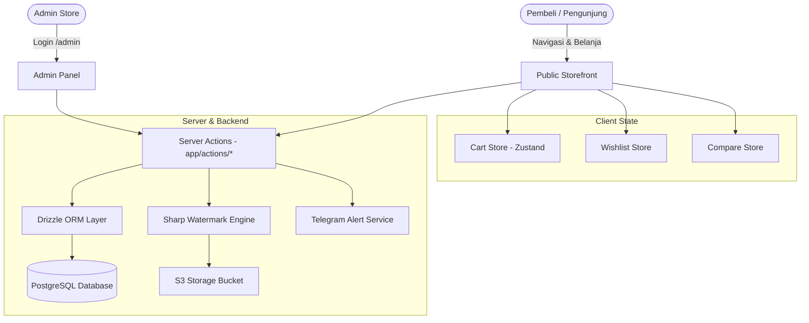

# 🚀 MASTER PLAN & SCALE PROJECT PART 1: PARFUME STORE

Dokumen ini merangkum seluruh peta rencana, arsitektur sistem, pembaruan yang telah dilakukan, serta rencana eksekusi fitur dari awal hingga tahap saat ini.

---

## 📑 DAFTAR ISI
1. [Identitas & Tech Stack Project](#1-identitas--tech-stack-project)
2. [Peta Arsitektur & Alur Data (Grapify)](#2-peta-arsitektur--alur-data-grapify)
3. [Logika Produk di Halaman Beranda (Home Page)](#3-logika-produk-di-halaman-beranda-home-page)
4. [Pembaruan Merek Real & Rich Metadata SEO (Selesai ✅)](#4-pembaruan-merek-real--rich-metadata-seo-selesai)
5. [Scale Project Part 1: Curated Gender Slots & 5-Brand Showcase Slider (Siap Dieksekusi ⏳)](#5-scale-project-part-1-curated-gender-slots--5-brand-showcase-slider-siap-dieksekusi-)

---

## 1. Identitas & Tech Stack Project

| Komponen | Teknologi | Keterangan |
| :--- | :--- | :--- |
| **Framework** | Next.js 16 (App Router) + React 19 | Server Components & Server Actions |
| **Styling** | TailwindCSS v4 | CSS murni dark mode & micro-animations |
| **Database** | PostgreSQL + Drizzle ORM | Schema UUID, singleton connection pool |
| **State Management** | Zustand | LocalStorage persist (Cart, Wishlist, Compare) |
| **Storage & Media** | S3 IDCloudHost + Sharp | Server-side upload & stempel watermark |
| **Notifikasi & Chat** | Telegram Bot API & WhatsApp | Auto-forward pesanan & bukti transfer |

---

## 2. Peta Arsitektur & Alur Data (Grapify)

---

## 3. Logika Produk di Halaman Beranda (Home Page)

1. **Server Fetching**: Mengambil 50 produk terbaru secara paralel dengan event War/Flash Sale dan Banner.
2. **Section War / Flash Sale**: Hitung mundur *real-time* item flash sale dengan kuota stok khusus.
3. **Section Popular & Sale**:
   * **Tab Most Popular**: Menyaring produk dengan status `isBestSeller = true` (Maks. 8 produk).
   * **Tab Sale**: Menyaring produk yang memiliki data diskon pada `stockData.salePrices` (Maks. 8 produk).
4. **Section Gender Split**:
   * **For Him**: Menyaring produk `gender = Men` (4 slot).
   * **For Her**: Menyaring produk `gender = Women` (4 slot).
   * **For Everyone**: Menyaring produk `gender = Unisex` (4 slot).
5. **Kalkulasi Harga Kartu Produk**: Mengambil ukuran pertama (misal *10ml*) via helper `getFirstSizePrice()`, menampilkan harga coret dan harga diskon tebal, serta badge *Sold Out* jika stok habis.

---

## 4. Pembaruan Merek Real & Rich Metadata SEO (Selesai ✅)

Telah disesuaikan untuk katalog produk real (**Mykonos**, **Velixir**, **Afnan**, dll.):

* ✅ **Pembaruan `lib/config.ts`**: Menambahkan puluhan brand lokal viral, brand Arabian Timur Tengah, dan brand desainer ke konstanta `BRANDS`.
* ✅ **Autocomplete Form Admin**: Menambahkan `<datalist>` pada input Brand di `/admin/products` dan `/admin/wars` agar admin mendapat saran instan tanpa harus mengetik manual.
* ✅ **Global SEO `app/layout.tsx`**: Title template, OpenGraph, Twitter Card, dan puluhan kata kunci spesifik parfum lokal & arabian, serta Schema JSON-LD `OnlineStore`.
* ✅ **Katalog SEO `app/products/layout.tsx`**: Metadata komprehensif untuk halaman katalog seluruh kategori wangi (*Fresh, Floral, Woody, Amber*).
* ✅ **Dynamic Product SEO `app/product/[id]/page.tsx`**: Otomatis merangkai metadata spesifik berdasarkan nama merek, nama produk, aroma, gender, dan ukuran botol.

---

## 5. Scale Project Part 1: Curated Gender Slots & 5-Brand Showcase Slider (Siap Dieksekusi ⏳)

### 🎯 Dua Fitur Utama yang Akan Dibangun:

#### A. Menu Pemilih Produk Spesifik di Gender Split (For Him, For Her, For Everyone)
Admin bisa langsung memilih dari dropdown produk mana saja yang ingin dipajang di:
* **For Him**: Slot 1, Slot 2, Slot 3, Slot 4.
* **For Her**: Slot 1, Slot 2, Slot 3, Slot 4.
* **For Everyone**: Slot 1, Slot 2, Slot 3, Slot 4.
*(Jika ada slot yang dikosongkan, sistem cerdas akan otomatis mengisi dengan produk terbaru).*

#### B. Fitur 5-Brand Showcase Slider (Urutan 1–5)
1. **Maksimal 5 Brand Aktif**: Admin hanya bisa mengaktifkan maksimal 5 brand.
2. **Validasi Penuh**: Jika admin mencoba memasukkan brand ke-6, sistem akan menolak dan memberi peringatan:
   > *"Maksimal 5 brand unggulan. Silakan hapus atau nonaktifkan brand yang ada terlebih dahulu sebelum menambahkan brand baru."*
3. **Urutan 1 sampai 5**: Nomor urut menentukan posisi dari atas ke bawah di Home.
4. **Slider Carousel Horizontal**: Slider navigasi panah `<` `>` menampilkan seluruh produk milik masing-masing brand tersebut.
5. **Tipografi Elegan**: Tanpa perlu upload file logo gambar.

---

### 📋 Checklist Eksekusi:
- [ ] **Langkah 1**: Buat skema `featured_brands` di `db/schema.ts` dan jalankan `npx drizzle-kit push`.
- [ ] **Langkah 2**: Buat Server Actions `featured-brands.ts` dan handler slot gender di `settings.ts`.
- [ ] **Langkah 3**: Buat halaman admin `/admin/featured-brands` (Tab Brand Slider & Tab Gender Slot Curation) + daftarkan di `AdminShell.tsx`.
- [ ] **Langkah 4**: Buat komponen `BrandShowcaseSlider.tsx` dengan navigasi geser panah `<` `>`.
- [ ] **Langkah 5**: Update `GenderSplit.tsx` dan `app/page.tsx` untuk menampilkan produk pilihan slot gender & slider brand.
- [ ] **Langkah 6**: Pengujian lengkap di admin dan beranda.
