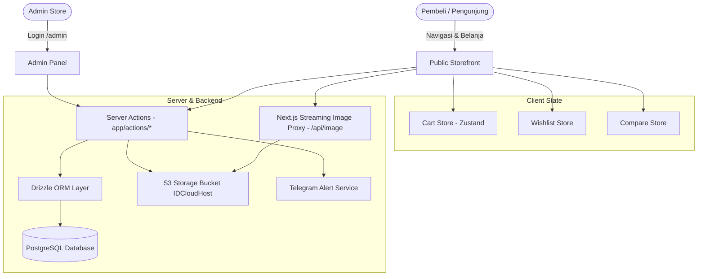

# 🗺️ 00_INDEX: MASTER PROJECT PLAN & MAP OF CONTENT (MOC)

Dokumen ini adalah **Pintu Gerbang Utama & Map of Content (MOC)** yang merangkum seluruh arsitektur sistem, status eksekusi fase, serta indeks navigasi ke setiap dokumen teknis di folder `docs/`.

---

## 📑 DAFTAR ISI
1. [Identitas & Tech Stack Project](#1-identitas--tech-stack-project)
2. [Peta Arsitektur & Alur Data Terkini](#2-peta-arsitektur--alur-data-terkini)
3. [Status Eksekusi Fase & Roadmap](#3-status-eksekusi-fase--roadmap)
4. [Fase 1: Master Brand & SEO Rich Metadata (Selesai ✅)](#4-fase-1-master-brand--seo-rich-metadata-selesai-)
5. [Fase 2: Scale Project Part 1 — Brand Ecosystem & Curated Slots (Selesai ✅)](#5-fase-2-scale-project-part-1--brand-ecosystem--curated-slots-selesai-)
6. [Fase 3: Photo Upload Fix & CSS Watermark Overlay (Selesai ✅)](#6-fase-3-photo-upload-fix--css-watermark-overlay-selesai-)
7. [Fase 4: Human Error Protection & Business Logic Audit (Selesai ✅)](#7-fase-4-human-error-protection--business-logic-audit-selesai-)
8. [Fase 5: Scale Project Part 2 — Frontend Luxury & S3 Streaming Proxy (Siap Eksekusi 🚀)](#8-fase-5-scale-project-part-2--frontend-luxury--s3-streaming-proxy-siap-eksekusi-)

---

## 1. Identitas & Lingkungan Produksi (Live Production Status)

> 🟢 **STATUS PROYEK: LIVE / SUDAH ONLINE DI PRODUCTION (COOLIFY)**  
> **Live Production URL:** `http://116.193.190.229`  
> **Repository:** GitHub (`main` branch) — Auto-deployed by Coolify Webhook

---

### 🌐 Konfigurasi Lingkungan Produksi (Coolify Environment):

| Parameter | Konfigurasi Live | Catatan Penting |
| :--- | :--- | :--- |
| **Hosting Platform** | Coolify Container (Nixpacks / Node.js) | IP Server: `116.193.190.229` |
| **Database** | PostgreSQL Container Remote (`:5432`) | 13 Tabel Aktif terverifikasi via `psql` |
| **Object Storage** | IDCloudHost S3 (`https://is3.cloudhost.id`) | Bucket: `parfume`, Region: `us-east-1` (Omit ACL) |
| **Framework** | Next.js 16 (App Router) + React 19 | Server Components & Server Actions |
| **Styling** | TailwindCSS v4 | Dark Mode Luxury (Obsidian `#0C0C0C` & Gold) |
| **State Management** | Zustand | LocalStorage persist (Cart, Wishlist, Compare) |
| **Notifikasi & Chat** | Telegram Bot API & WhatsApp | Auto-forward pesanan, Direct WhatsApp Buy Toggle |

---

### ⚠️ PROTOKOL KEAMANAN LINGKUNGAN LIVE (PRODUCTION SAFETY RULES):

1. **JANGAN MERUSAK SKEMA DATABASE LIVE**:
   * Setiap penambahan kolom baru (seperti piramida aroma) **WAJIB bersifat nullable atau memiliki nilai default** (`ALTER TABLE ... ADD COLUMN IF NOT EXISTS`).
   * Dilarang melakukan migrasi destruktif (`DROP TABLE` atau `DROP COLUMN`) pada database produksi.
2. **KONSISTENSI ENVIRONMENT VARIABLE (`process.env`)**:
   * Kode aplikasi **TIDAK BOLEH mengasumsikan nama variabel frontend `NEXT_PUBLIC_` secara kaku** jika variabel di Coolify hanya berformat server (`S3_BUCKET`, `S3_ENDPOINT`).
   * Gunakan helper dinamis seperti `lib/image-proxy.ts` dan Next.js internal streaming proxy (`/api/image`).
3. **PROTEKSI `package.json`**:
   * Hindari modifikasi versi dependency pada `package.json` yang dapat menyebabkan kegagalan build container di Coolify.
4. **ZERO S3 CLUTTER (BUKTI TRANSFER)**:
   * Foto bukti transfer pembayaran dari pembeli **HANYA dikirim ke Bot Telegram**, DILARANG disimpan di S3 untuk menghemat kuota penyimpanan.

---

## 2. Peta Arsitektur & Alur Data Terkini



---

## 3. Status Eksekusi Fase & Roadmap

| Fase | Nama Modul | Status | Dokumen Referensi |
| :---: | :--- | :---: | :--- |
| **Pilar 0** | Master Brand & Dynamic SEO | **SELESAI ✅** | [docs/PROJECT_PLAN.md](file:///d:/parfume/docs/PROJECT_PLAN.md) |
| **Pilar 1** | Scale Project Part 1 (5-Brand Slider & Gender Slots) | **SELESAI ✅** | [docs/SCALE_PROJECT_PART_1.md](file:///d:/parfume/docs/SCALE_PROJECT_PART_1.md) |
| **Pilar 2** | S3 Photo Upload & CSS Watermark Overlay | **SELESAI ✅** | [docs/PLAN_FIX_UPLOAD_WATERMARK.md](file:///d:/parfume/docs/PLAN_FIX_UPLOAD_WATERMARK.md) |
| **Pilar 2.1** | Cleanup Dead Code & Upload Normalization | **SELESAI ✅** | Commit `062f584`, `f6158a7` |
| **Pilar 3** | Human Error Protection & Transaction Audit (41 Points) | **SELESAI ✅** | [docs/HUMANERROR.md](file:///d:/parfume/docs/HUMANERROR.md) |
| **Pilar 4** | Scale Project Part 2 (Frontend Luxury & Admin Functions) | **SIAP EKSEKUSI 🚀** | [docs/SCALE_PROJECT_PART_2.md](file:///d:/parfume/docs/SCALE_PROJECT_PART_2.md) |

---

## 4. Fase 1: Master Brand & SEO Rich Metadata (Selesai ✅)
* ✅ **Master Brand Dataset (`lib/config.ts`)**: Brand lokal viral (*Mykonos, Velixir, HMNS*), Arabian (*Afnan, Lattafa*), dan Luxury Designer.
* ✅ **Autocomplete Form Admin**: `<datalist id="brand-suggestions">` di `/admin/products` dan `/admin/wars`.
* ✅ **Root & Dynamic SEO**: JSON-LD `OnlineStore`, OpenGraph, Twitter Cards, dan sitemap dinamis.

---

## 5. Fase 2: Scale Project Part 1 — Brand Ecosystem & Curated Slots (Selesai ✅)
* ✅ **Skema Database `featured_brands`**: Tabel PostgreSQL dengan limit maksimal 5 brand aktif dan urutan 1–5.
* ✅ **Server Actions `featured-brands.ts`**: Proteksi admin, validasi penolakan brand ke-6, dan revalidasi cache.
* ✅ **Panel Admin `/admin/featured-brands`**: Tab manajemen 5-Brand Showcase Slider dan Tab Kurasi 12 Slot Gender (*For Him, For Her, For Everyone*).
* ✅ **Frontend Beranda `BrandShowcaseSlider.tsx`**: Horizontal carousel slider dengan tombol chevron `<` dan `>`.
* ✅ **Integrasi Beranda `GenderSplit.tsx`**: Menampilkan 4 produk pilihan admin per gender dengan fallback produk terbaru.

---

## 6. Fase 3: Photo Upload Fix & CSS Watermark Overlay (Selesai ✅)
* ✅ **Client Canvas Image Compression (`lib/compression.ts`)**: Kompresi gambar di browser pembeli/admin sebelum upload (mengurangi ukuran >1MB menjadi <300KB).
* ✅ **Multi-MIME & Non-Forced JPG**: Mendukung PNG transparan, WebP, dan JPEG tanpa konversi paksa Sharp.
* ✅ **Non-Destructive CSS/HTML Watermark Overlay**: Teks miring `BEST PARFUME STORE ` (`opacity: 0.06`, `rotate: -25deg`) langsung di browser tanpa merusak file foto asli.
* ✅ **Zero S3 Clutter (Direct-to-Telegram)**: Bukti bayar dikirim langsung ke bot Telegram tanpa disimpan di S3.

---

## 7. Fase 4: Human Error Protection & Telegram Approval Bot (39 Fixed ✅)
* ✅ **39 Item Telah Selesai**: Termasuk Telegram Payment Approval Bot — upload bukti bayar → status `PROOF_UPLOADED` → Telegram foto + tombol `[✅ Setujui] [❌ Tolak]` → admin tekan → webhook update DB. Semua 4 tugas lanjutan (H2, M11, L5, L8) sudah selesai.
* ⏳ **1 Deferred (M10)**: X-Forwarded-For reverse proxy config pada Coolify.
* ❌ **2 Ditutup (H9, M6)**: Redis rate limiter dan Token IDOR tidak diperlukan untuk single-instance server.

---

## 8. Fase 5: Scale Project Part 2 — Frontend Luxury & S3 Streaming Proxy (Siap Eksekusi 🚀)
* 🚀 **Pilar 1**: Streaming S3 Image Proxy (`/api/image/route.ts`) dengan cache 24 jam & normalizer URL mandiri (`lib/image-proxy.ts`).
* 🚀 **Pilar 2**: Direct WhatsApp Checkout dengan Master Admin Toggle Switch di `/admin/settings` (`whatsapp_order_button_enabled`).
* 🚀 **Pilar 3**: Visual Fragrance Notes Pyramid (*Top, Heart, Base Notes*) 100% Database-Driven (`products.top_notes`, `middle_notes`, `base_notes`, `longevity`, `sillage`, `concentration`).
* 🚀 **Pilar 4**: Input Form Piramida Aroma di Panel Admin Produk (`/admin/products`).
* 🚀 **Pilar 5**: Mobile Sticky Bottom Buy Bar di Detail Produk (`components/product/StickyBuyBar.tsx`).
* 🚀 **Pilar 6**: Trust Badges & Carousel Rekomendasi Produk Terkait (*"You May Also Like"*).
* 🚀 **Pilar 7**: Quick Size Pills (`30ml • 50ml`) & Stock Badges di Kartu Produk (`ProductCard.tsx`).
* 🚀 **Pilar 8**: Koreksi Navigasi Kontak Header langsung ke WhatsApp CS resmi.

---

## 9. Deployment Guide (Coolify Production)

### Environment Variables

| Variable | Required | Description |
|----------|----------|-------------|
| `DATABASE_URL` | ✅ | PostgreSQL connection string |
| `NEXT_PUBLIC_BASE_URL` | ✅ | Domain production (https://...) |
| `S3_ENDPOINT` | ✅ | `https://is3.cloudhost.id` |
| `S3_REGION` | ✅ | `us-east-1` |
| `S3_ACCESS_KEY` | ✅ | IDCloudHost S3 access key |
| `S3_SECRET_KEY` | ✅ | IDCloudHost S3 secret key |
| `S3_BUCKET` | ✅ | Bucket name (e.g. `parfume`) |
| `ADMIN_EMAIL` | ✅ | Admin login email (auto-seed on startup) |
| `ADMIN_PASSWORD` | ✅ | Admin login password (auto-seed on startup) |
| `SESSION_SECRET` | ✅ | Random string for cookie signing |
| `TELEGRAM_BOT_TOKEN` | ⚠️ Optional | Bot token dari @BotFather |
| `TELEGRAM_CHAT_ID` | ⚠️ Optional | Chat ID admin untuk notifikasi |

### First Deploy

```bash
# 1. Push ke GitHub
git push origin main

# 2. Coolify auto-builds (~2-5 min)

# 3. Set DB schema (buka terminal di Coolify Dashboard)
npx drizzle-kit push

# 4. Set Telegram webhook (jika pakai)
curl -X POST "https://api.telegram.org/bot<TOKEN>/setWebhook" \
  -d '{"url":"https://yourdomain.com/api/telegram/webhook"}'

# 5. Verifikasi webhook
curl "https://api.telegram.org/bot<TOKEN>/getWebhookInfo"
```

### Subsequent Deploys

```bash
git add -A && git commit -m "feat: ..." && git push origin main
# Coolify auto-build. Tidak perlu manual migration kecuali schema berubah.
```

### Schema Migration (jika ada perubahan table)

```bash
npx drizzle-kit generate    # Generate SQL migration
npx drizzle-kit push        # Push ke DB
```

### Rollback

```bash
# Option 1: Revert commit
git revert HEAD && git push origin main

# Option 2: Coolify Dashboard → Deployment → Rollback to previous
```

### Telegram Webhook Management

```bash
# Set webhook
curl -X POST "https://api.telegram.org/bot<TOKEN>/setWebhook" \
  -H "Content-Type: application/json" \
  -d '{"url":"https://yourdomain.com/api/telegram/webhook"}'

# Check webhook status
curl "https://api.telegram.org/bot<TOKEN>/getWebhookInfo"

# Delete webhook (fallback: bot stops receiving callbacks)
curl "https://api.telegram.org/bot<TOKEN>/deleteWebhook"
```

### Troubleshooting

| Masalah | Solusi |
|---------|--------|
| Build gagal di Coolify | Cek Node version (harus 22), cek build logs |
| Gambar tidak tampil | Cek S3 env vars, test: `npm run test:s3` |
| Login gagal | Cek `ADMIN_EMAIL`/`ADMIN_PASSWORD` di Coolify env |
| Webhook Telegram tidak jalan | Cek HTTPS aktif, cek `getWebhookInfo` untuk error |
| Tombol approve tidak merespon | Cek Coolify logs untuk webhook POST errors |

---
*Dokumen ini merupakan panduan master repositori parfume. Seluruh eksekusi berjalan berurutan sesuai roadmap di atas.*
